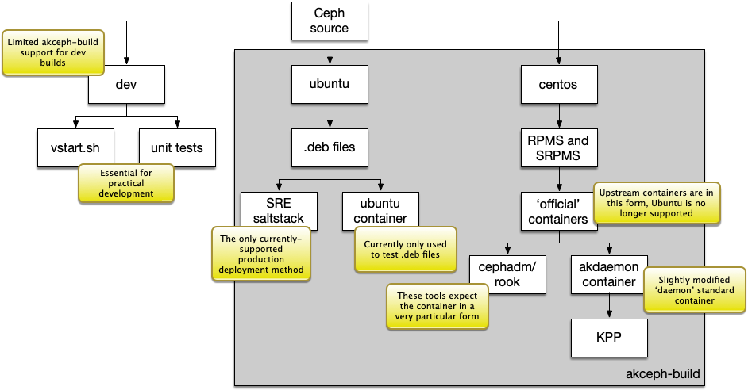

# Ceph builds

<!-- vscode-markdown-toc -->
* [Overview](#Overview)
	* [Ceph builds types and applications](#Cephbuildstypesandapplications)
	* [Why three targets?](#Whythreetargets)
* [Ubuntu target](#Ubuntutarget)
* [CentOS target](#CentOStarget)
* [Future: Changing the CentOS target](#Future:ChangingtheCentOStarget)

<!-- vscode-markdown-toc-config
	numbering=false
	autoSave=true
	/vscode-markdown-toc-config -->
<!-- /vscode-markdown-toc -->

## <a name='Overview'></a>Overview

These are some high-level notes on the various types of Ceph builds in play.

### <a name='Cephbuildstypesandapplications'></a>Ceph builds types and applications



The diagram shows the different types of build required today.

- Dev builds are self-explanatory, but note that developers often need
  clusters, and clusters can be difficult to deploy. `vstart.sh` is the
  in-tree method of creating a single-machine cluster to work with, and this
  is fantastically useful; however, it has obvious limitations. Being able to
  build containers that can be part of larger clusters is also useful.

- Ubuntu builds are for the current (gen1) standard deployment. They are built
  using the tooling in the Ceph source repository (`make-debs.sh`) and the
  process for building the .deb packages is automated by `akceph-build`.

- CentOS builds are so we can build 'standard' or 'official' containers. By
  'official', here I mean that these are containers built using the
  `ceph-container` infrastructure maintained by upstream. (More on
  `ceph-container` later.) The standard containers are those deployable using
  the `cephadm` and `rook` tools, as well as the base for the container
  deployed to gen2 KPP.

### <a name='Whythreetargets'></a>Why three targets?

The dev target is at least two orders of magnitude faster to work with when
making source changes. A rebuild and redeploy of rgw only can take a few
seconds, whereas a .deb, .rpm or container redployment is at best many tens of
minutes.

The Ubuntu .deb file target is how we deploy today. It's the only deployment
SRE provide.

The CentOS target is how upstream deploy today, and we should be cautious
when considering how upstream (Red Hat) will be with maintenance of the
Ubuntu targets in the future. Already they've dropped support for the standard
container build Ubuntu-based targets.

We won't discuss the dev target here as each developer's environment will
vary. However, it is important to be able to perform local, native builds -
waiting for complete rebuilds and redeployments on minor changes is a terrible workflow.

## <a name='Ubuntutarget'></a>Ubuntu target

Builds to Ubuntu targets are directly supported by the Ceph source, via
`install-deps.sh` and `make-debs.sh`.

Since Ceph is a low-level system, this support is somewhat OS- and
Ceph-version specific. For example, Ceph 17 and Ceph 18 use different versions
of the C++ standard (Ceph 17 uses C++17, Ceph 18 uses C++20), and so require
different compilers, and in the Ceph 18 case, different versions of the C++
Standard Library.

These tool changes cascade. Using the C++ compiler example, `install-deps.sh`
knows which versions of Ubuntu require special efforts to obtain a compatible
compiler, and for Ceph 18 adds a custom package repository in order to support
the required version of GCC.

This is one of several reasons why work has gone into containerising the
build. In the short term, this makes it easier to build .deb packages. In the
longer term, and if and only if SRE support this effort, using containers to
deploy will help isolate us from the host OS in a way that _will_ simplify
matters in the future.

The container target is completely bare-bones - an image is created, based on
a standard Ubuntu image, and the Ceph .deb packages are installed into it.
This is used to test the installation, but more tooling would need to be added
to make it more useful for production. However, as we'll see there's reason to
not use the Ubuntu container for this, and since it's containerised there's no
good reason to prefer one host OS over the other.

## <a name='CentOStarget'></a>CentOS target

The ability to build CentOS RPMS and SRPMS (respectively, binary and source
RPM packages) is new (April 2024). It was added to support the construction of
images whose structure matches the upstream images, so that tools constructed
to support the upstream images will work seamlessly with our custom Ceph
builds.

- Build using the CentOS Stream base image instead of the now-dead CentOS base.

It used to be the case that the tool used to build the upstream images (called
[ceph-container](https://github.com/ceph/ceph-container)) would build images
for a variety of container bases, including Ubuntu. This support has been
removed, and is very unlikely to return.

In addition, the base images until recently were based on CentOS 8, the last
'regular' CentOS release before the CentOS brand was acquired by Red Hat. Now,
CentOS 8 has been retired, and the upstream Yum repositories are offline.

It was briefly possible to build using CentOS Stream 8, but in late May 2024
Red Hat also offlined the repositories for Stream 8. In June 2024 our build
was moved to CentOS Stream 9. Literally no one is happy with this as the
ultimate target, but it is the best available that we can build with existing
resources today. Building using Ubuntu does not work well with the
ceph-container repo. We don't have Red Hat Enterprise Linux licenses at Akamai
to my knowledge. Building using UBI9 really requires a RHEL machine, which we
don't have.

Once the base image is built, we want (of course) to install non-standard Ceph
RPM packages into it, built using our non-standard Ceph source. There's *no*
support for this in ceph-container!

All this means we have a fork of ceph-container (currently
[here](https://github.com/andrelucas/ceph-container) in branch `atl-akceph`)
that allows us to manipulate the `make` invocation so that we can both:

- Install our custom packages instead of the upstream official releases.

ceph-container builds three images, `daemon-base`, `daemon` and `demo`. We
only really care about `daemon`, though we build the others. We then build one
more image, `akdaemon-gen2`, which is the `daemon` image plus a couple of
directives to make the container compatible with our KPP deployment
environment.

## <a name='Future:ChangingtheCentOStarget'></a>Future: Changing the CentOS target

This is my (André's) speculation about how we deal with the non-optimal nature of this
target in the future.

No one is happy with using CentOS stream. However, it is by far the easiest
way to utilise the work done in `ceph-container`. If you look at the `main`
branch of `ceph-container` as of 2024-06-21, you'll see this:

```makefile
# All flavor options that can be passed to FLAVORS
ALL_BUILDABLE_FLAVORS := \
        pacific,centos,8 \
        quincy,centos,9 \
        reef,centos,9 \
        squid,centos,9 \
        main,centos,9
```

These are the 'flavors' of the build that are supported, in the sense that
_anything_ here is really supported. Even there, the first one
`pacific,centos,8` now won't build because CentOS 8 (and Stream 8) are
offline.

All things being equal we want to use the 'official' resources so we have to
do as little in-house work as possible. Using `ceph-container`, we have a few alternatives:

- Go with a flavour not on the list and hope it works.

- Add support for a different flavour and support it.

Either is a perfectly fine choice. However, `ceph-container` is not at all
easy to work with. Generating the Dockerfiles from the templates found in the
source is infuriatingly tricky to understand and extremely error-prone.

Another alternative is to simply pick a target and build the containers we
need without `ceph-container`. This is, to my mind, the best option. We need
to schedule the work.
